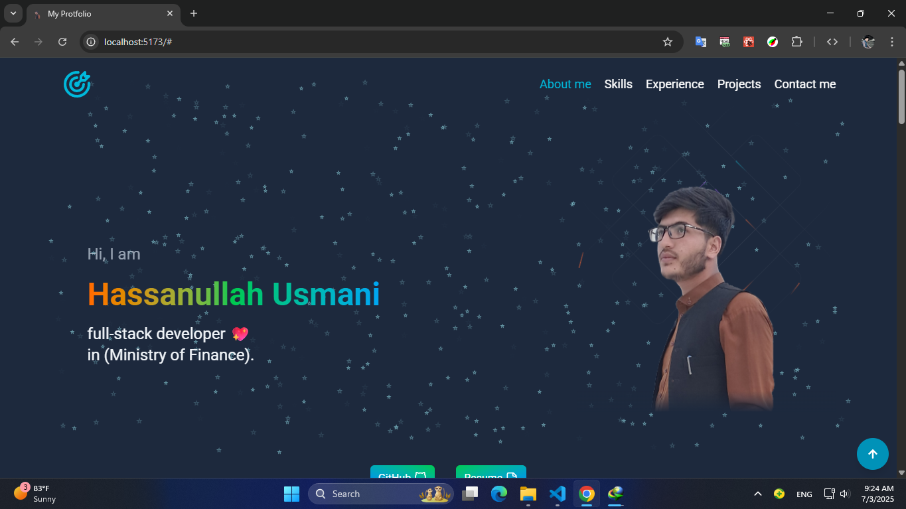

<!-- تصویر معرفی -->
<p align="center">
  
</p>

# 💼 MyPortfolio

✨ A modern and responsive portfolio website to showcase my skills, projects, and experience as a Full Stack Developer.

🌐 **Live Site**: [hassanullahusmani-portfolio.netlify.app](https://hassanullahusmani-portfolio.netlify.app)

---

## 📌 Features

- 📱 Responsive design for all screen sizes
- 🌙 Dark / Light mode support
- 🧑‍💻 AboutMe, Skills, Experience, Projects and Contact me
- 🛠️ Projects with live demo and code links
- 📞 Contact form

---

## 🛠️ Tech Stack

- **Frontend:** React, TypeScript, Tailwind CSS
- **Animations:** Framer Motion
- **State Management:** useState, useEffect (Vanilla React)

---

## 🚀 Getting Started

```bash
# Clone the repository
git clone https://github.com/hassanullahusmani45/My-Portfolio.git

# Navigate to the project
cd MyPortfolio

# Install dependencies
npm install

# Run the development server
npm run dev
